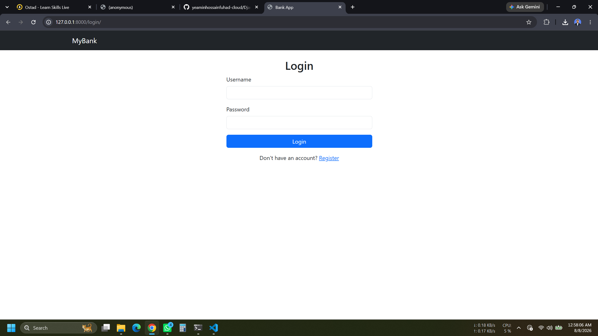
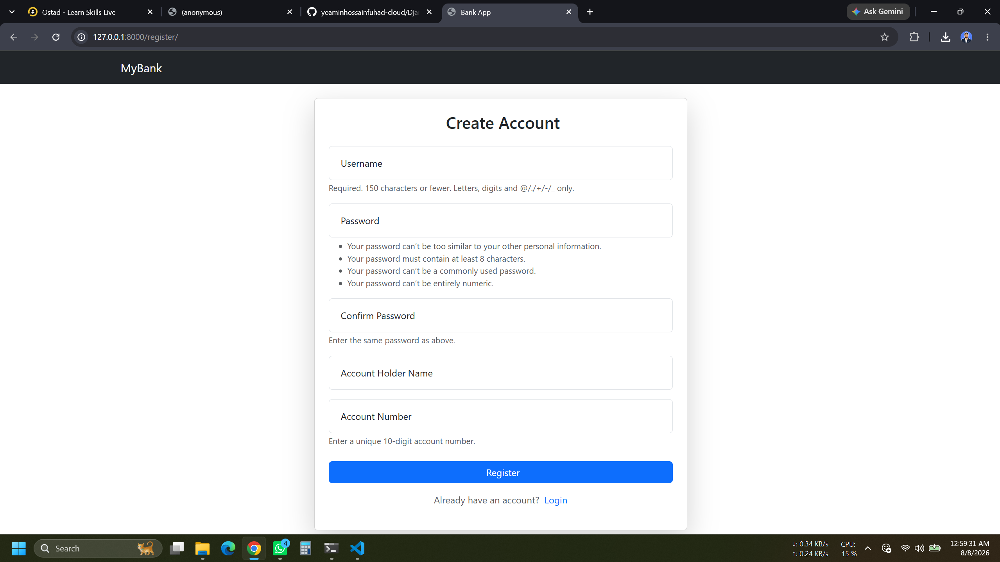
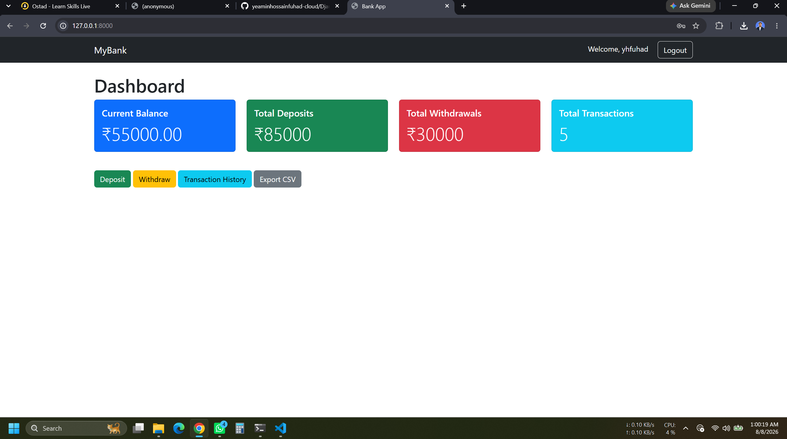
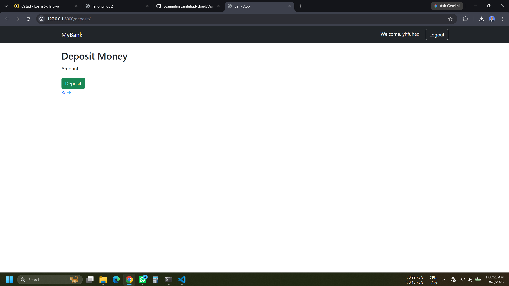
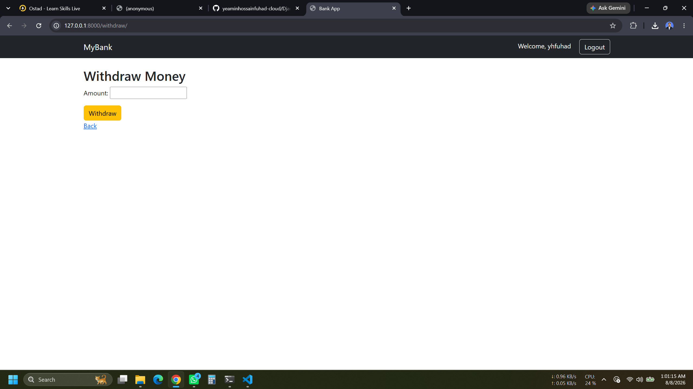
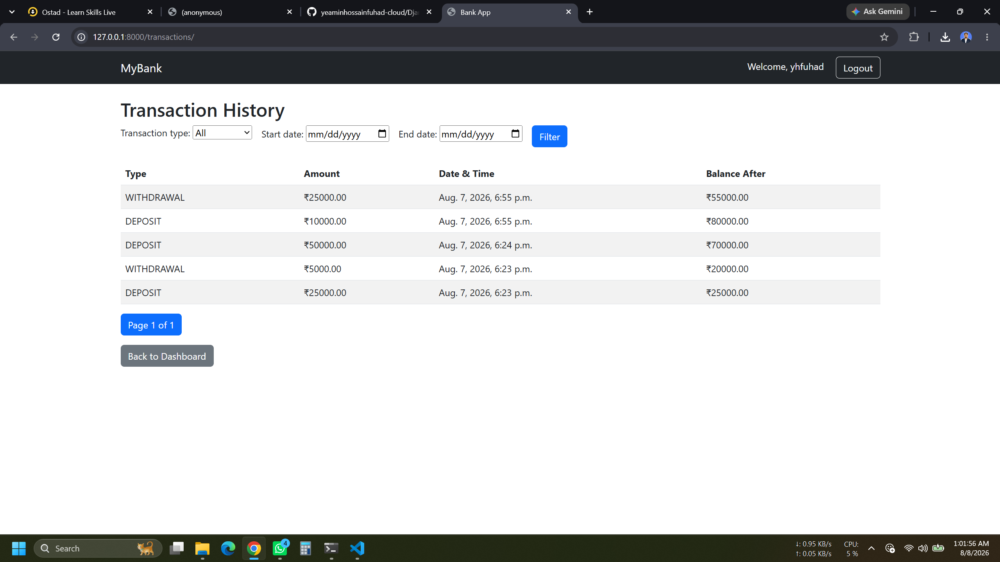

# Django Bank Account Transaction Management System

A secure **Bank Account Transaction Management System** built with **Django**. This application allows authenticated users to create and manage their own bank account, perform deposits and withdrawals, and view transaction history securely.

---

# Project Information

**Project Name:** Bank Account Transaction Management System

**Framework:** Django

**Language:** Python 3

**Database:** SQLite3

**Frontend:** HTML5, CSS3, Bootstrap 5

**Authentication:** Django Authentication System

---

# Features

## Part 1: User Authentication
- User Registration
- User Login
- User Logout
- Login Required for all pages
- Users can only access their own account and transaction data

---

## Part 2: Bank Account Management
- Create Bank Account
- Store Account Holder Name
- Store Account Number
- Store Current Balance
- Display Account Information on Dashboard

---

## Part 3: Deposit Money
- Deposit amount must be greater than 0
- Automatically updates account balance
- Saves deposit transaction
- Displays success message

---

## Part 4: Withdraw Money
- Withdraw amount must be greater than 0
- Prevents overdraft
- Updates account balance
- Saves withdrawal transaction

---

## Part 5: Transaction History
Displays:

- Transaction Type
- Amount
- Date & Time
- Balance After Transaction

Transactions are displayed in **Newest First** order.

---

## Part 6: Search & Filter
- Search by Transaction Type
- Filter Transactions by Date

---

## Part 7: Dashboard
Dashboard displays:

- Current Balance
- Total Deposits
- Total Withdrawals
- Total Transactions

---

# Bonus Features
- Bootstrap 5 Responsive UI
- Monthly Transaction Summary

---

# Technologies Used

- Python 3
- Django
- SQLite3
- Bootstrap 5
- HTML5
- CSS3

---

# Project Structure

```
Bank_Transaction_System/
│
├── accounts/
├── transactions/
├── templates/
├── static/
├── media/
├── db.sqlite3
├── manage.py
├── requirements.txt
└── README.md
```

---

# Installation

## 1. Clone the Repository

```bash
git clone https://github.com/yeaminhossainfuhad-cloud/Django_Bank_Account_Transaction_Management_System.git
```

---

## 2. Navigate to Project Folder

```bash
cd bank-transaction-system
```

---

## 3. Create Virtual Environment

```bash
python -m venv venv
```

---

## 4. Activate Virtual Environment

### Windows

```bash
venv\Scripts\activate
```

### Linux / macOS

```bash
source venv/bin/activate
```

---

## 5. Install Required Packages

```bash
pip install -r requirements.txt
```

---

## 6. Apply Database Migrations

```bash
python manage.py makemigrations
python manage.py migrate
```

---

## 7. Create Superuser

```bash
python manage.py createsuperuser
```

---

## 8. Run Development Server

```bash
python manage.py runserver
```

Open your browser and visit:

```
http://127.0.0.1:8000/
```

---

# Screenshots

## Login Page



---

## Register Page



---

## Dashboard



---

## Deposit Money



---

## Withdraw Money



---

## Transaction History



---

# Database Models

## Account Model

| Field | Type |
|------|------|
| User | ForeignKey |
| Account Holder Name | CharField |
| Account Number | CharField |
| Current Balance | DecimalField |

---

## Transaction Model

| Field | Type |
|------|------|
| Account | ForeignKey |
| Transaction Type | CharField |
| Amount | DecimalField |
| Balance After Transaction | DecimalField |
| Date & Time | DateTimeField |

---

# Validation Rules

### Deposit
- Amount must be greater than 0

### Withdraw
- Amount must be greater than 0
- Withdrawal amount cannot exceed current balance

### Security
- Login Required
- Users cannot access other users' data
- CSRF Protection Enabled

---

# Assignment Requirements Checklist

| Requirement | Status |
|------------|--------|
| User Registration | ✅ |
| User Login | ✅ |
| User Logout | ✅ |
| Authentication | ✅ |
| Bank Account Management | ✅ |
| Deposit Money | ✅ |
| Withdraw Money | ✅ |
| Prevent Overdraft | ✅ |
| Transaction History | ✅ |
| Search Transactions | ✅ |
| Date Filter | ✅ |
| Dashboard Summary | ✅ |
| Bootstrap UI (Bonus) | ✅ |
| Monthly Summary (Bonus) | ✅ |

---

# Future Improvements

- CSV Export
- Pagination
- Charts
- Email Notifications
- Password Reset
- REST API
- Dark Mode

---

# Author

**Md. Yeamin Hossain Fuhad**

- Diploma in Engineering in Computer Science & Technology
- B.Sc. in Computer Science & Engineering, World University of Bangladesh
- IT Support, Popular Diagnostic Centre
- Aspiring Python Django Developer & Software Quality Assurance (SQA) Engineer
